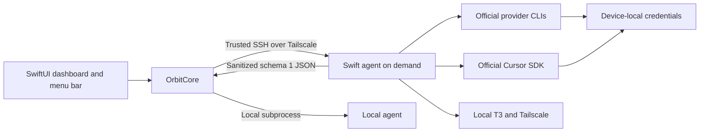

# Architecture and trust boundaries

Orbit is a controller, not a central credential vault. Each Mac remains independently usable when the controller is off.

## Ownership

- `OrbitCore`: data contract, SSH policy, process deadlines, safe inventory storage. No SwiftUI or provider SDK dependency.
- `OrbitAgent`: local adapters. Snapshots inspect sessions and may call `Cursor.me`, but never inference. Explicit access checks run isolated tiny prompts.
- `OrbitApp`: fleet UI, refresh scheduling, local verification cache, explicit actions, optional notifications.
- Providers own login and token refresh. Managed sign-in runs only after an explicit user action, never as automatic background repair.

## Schema and truthfulness

`snapshot` and `verify` emit one JSON object with UTC ISO 8601 dates. Schema 1 requires all four provider IDs. The client rejects unsupported schemas, duplicates, missing providers, and snapshots more than five minutes from its clock.

Only an exact successful model response can produce `verified`. Rejected authentication, usage limits, and other failures are distinct. Successful checks expire after 15 minutes. Authentication rejection remains actionable until replaced by a new result; starting or cancelling login does not erase that rejection. Unreachable Macs cannot appear healthy because of previous provider verification.

## Trust and privacy

- SSH uses argument arrays, validated host fields, pinned known-host aliases, and strict host-key verification. Unknown host trust is interactive.
- No listening agent daemon, ingress rule, central fleet API key, or privileged service is introduced.
- Access/refresh tokens never enter snapshot JSON, inventory, app cache, Git, or diagnostics. Emails are masked. Short-lived authorization URLs and device codes are the explicit exception: they travel over the owned local/SSH process into temporary UI memory, are allowlisted on both ends, and are never persisted or logged.
- Subprocess diagnostics stay in memory and become fixed messages. Paid API-key environment overrides are removed for subscription checks.
- Cursor uses the official SDK and current default T3 binding. This local adapter must be reviewed when T3 changes its secret-store contract.
- Agent installation updates only Orbit-owned symlink targets. It refuses an unrelated existing executable.
- Inventory is private and never a repository fixture. Credential-bearing URLs and non-web schemes are rejected.

## Failure and recovery

Refresh cycles do not overlap. Subprocess output and execution time are bounded. Only owned child processes are terminated on timeout. A failed request does not erase a credential, and a usage limit does not trigger login. T3 health is independent of provider sign-in.

Install the matching agent after SSH trust is established. Existing T3 and provider services remain running. Rollback means quitting Orbit and removing only its own launcher/versioned agent files; preserve provider and T3 data. Explicit Claude migration retains a private local credential archive.

Billing APIs, independent 24/7 monitoring, signed release downloads, automatic service recovery, custom Cursor bindings, and encrypted alternative secret stores are outside 0.2.

## Managed login contract

`login-bridge <provider>` uses schema 1 JSON lines over a single owned stdin/stdout session. Only typed lifecycle events and allowlisted provider authorization challenges are exported. Incoming commands are limited to cancellation and a validated Claude authorization code; there is no arbitrary terminal/shell input channel. Provider stdout/stderr is inspected locally in bounded memory and never forwarded verbatim. EOF, explicit cancellation, and deadlines terminate the owned child. An advisory private file lock prevents competing Orbit logins on one Mac. Codex file-cache login takes a temporary private backup on the target. Failed/cancelled attempts restore a removed cache with 0600 permissions; new or externally changed caches are preserved. Recovery failures retain the local backup for review. Keyring rollback is outside this adapter.

A zero exit from the official login means **signed in**, not **ready**. The controller then takes a fresh snapshot and verifies real access. Cancellation or late events cannot turn a stopped flow into Ready. Bad schema/provider identities, credential-bearing/untrusted URLs, malformed records, nonzero exits, and interrupted transports fail closed with fixed diagnostics.

The reconnection queue is created only by an explicit controller action. It processes one device/provider pair at a time, advances after verified success, pauses on failure, and offers retry, skip, and stop. A queue and fleet verification cannot overlap. Stopping clears pending actions; queued work is never persisted or resumed silently.

Snapshots remain schema 1, so existing status consumers remain compatible. The managed-login command requires agent 0.2. Update agents before using the new app. Credentials stay on the target Mac; Cursor refuses unrecognized or encrypted existing stores. Independent Claude sign-in retires only recognized private launchers and retains a local recovery archive.

`FleetCoordinator` owns the shared check policy for the SwiftUI connection center and `orbitctl`. It verifies authenticated providers with stale/missing checks, skips valid checks and missing logins, and preserves usage/authentication failures as separate outcomes. The controller publishes sanitized status JSON, never login challenges. It is an on-demand CLI, not a public API or unattended authentication service.
