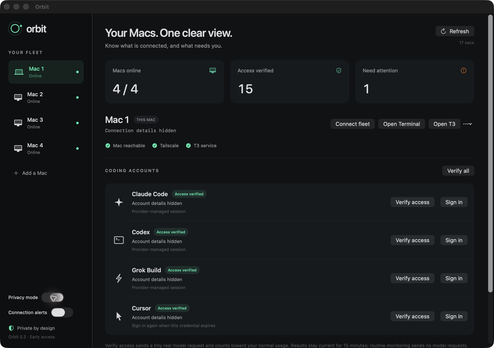
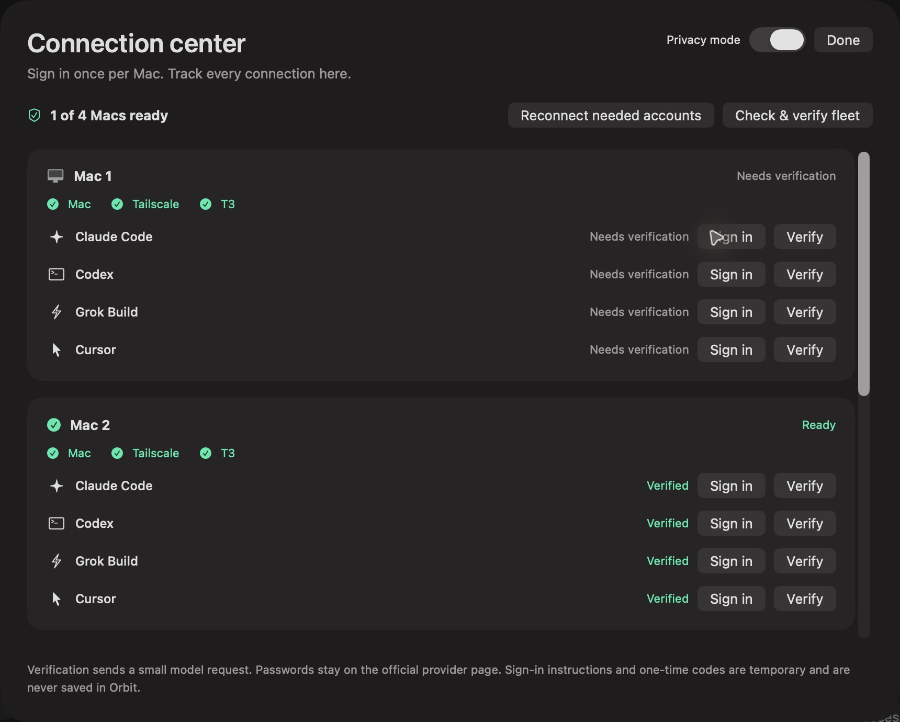

# Orbit 0.2.0 — Early access

Your Macs and AI coding accounts in one native macOS control room.

## Included

- SwiftUI fleet dashboard and menu bar companion, with separate Mac, Tailscale, and T3 health.
- Claude Code, Codex, Grok Build, and Cursor session visibility and explicit model access checks.
- A connection center for official sign-in on the selected Mac, temporary challenges, cancellation, and post-login verification.
- Guided reconnection with retry, skip, stop, and verification before advancing.
- Trusted SSH agents, private inventory and check cache, sanitized `orbitctl` status, and target-local Codex cache recovery.
- Privacy mode for device names, addresses, account details, and sign-in instructions.

## Install

Download `Orbit-v0.2.0-macos-arm64.zip`, verify it against `SHA256SUMS`, extract it, and move `Orbit.app` to Applications. Requires **Apple Silicon, macOS 14+, Node.js 22.13+, and the official provider CLIs** on each target. The Cursor SDK is bundled on the controller; remote targets need a compatible runtime.

This binary is ad hoc signed and **not notarized**. Review the source and build locally, or use the normal macOS app approval flow if you trust the release. Keep system protections enabled.

Follow the [user guide](../user-guide.md) to add a trusted SSH Mac and start official sign-in. Update existing remote agents from this build before resuming authentication.

## Validation and current limits

Local validation includes 29 core/agent tests, release build, Swift formatting, bundle-signature checks, and native visual review. Live integration recorded four reachable Macs and 15 of 16 successful provider checks; the remaining account required fresh sign-in. This is recorded evidence, not a guarantee of current account access.

Completed provider-browser approval, MFA recovery, and automatic queue advancement need broader end-to-end coverage. Monitoring requires an awake controller with Orbit running. No independent 24/7 service, billing management, paid renewal, notarization, or automatic service recovery is included.

See [troubleshooting](../troubleshooting.md), [architecture](../architecture.md), and [roadmap](../roadmap.md).
